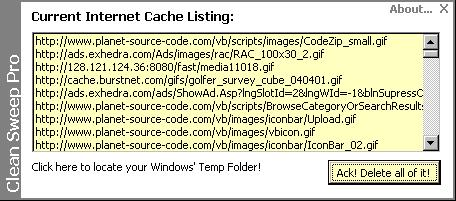



## CleanSweepPro \- Clear IE Cache that WORKS\!

### Description

CleanSweepPro uses the Win32 API (WinInet.dll) to enumerate all entries in the URL Cache and then remove them. THIS WORKS! I made this because I was really tired with all the non-working 'Clear Your Steps' type programs that only worked on Windows 95. Read the 'about..' section if you have questions/problems. This is a good example of OOP, Win32 API, WinInet, and more! Enjoy!
 
### More Info
 
Notta

A message if your cache is cleared.

You will lose your IE cache.

             |
---                |---
**Submitted On**   |2002-04-23 15:59:46
**By**             |[Chase Gale](https://github.com/Planet-Source-Code/PSCIndex/blob/master/ByAuthor/chase-gale.md)
**Level**          |Advanced
**User Rating**    |4.4 (22 globes from 5 users)
**Compatibility**  |VB 6\.0
**Category**       |[Internet/ HTML](https://github.com/Planet-Source-Code/PSCIndex/blob/master/ByCategory/internet-html__1-34.md)
**World**          |[Visual Basic](https://github.com/Planet-Source-Code/PSCIndex/blob/master/ByWorld/visual-basic.md)
**Archive File**   |[CleanSweep749924232002\.zip](https://github.com/Planet-Source-Code/chase-gale-cleansweeppro-clear-ie-cache-that-works__1-34075/archive/master.zip)

### API Declarations

Many =)

